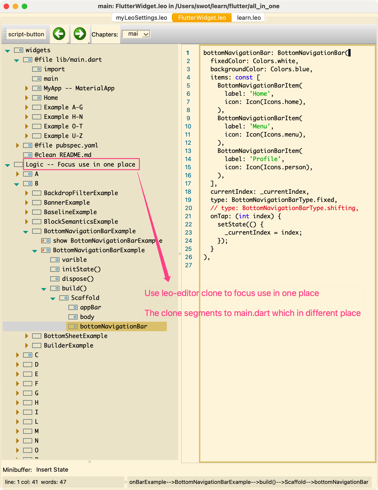

## Flutter built in Widgets

This project is for main using Widgets.

Using Literate Programming [leo-editor](https://github.com/leo-editor/leo-editor) tool to manage code structure.

### A...

    AboutDialog
    AboutListTile
    AbsorbPointer -- include button can not be clicked
    AlertDialog
    Align
    AnimatedAlign
    AnimatedBuilder
    AnimatedContainer
    AnimatedCrossFade
    AnimatedDefaultTextStyle
    AnimatedIcon
    AnimatedList
    AnimatedModalBarrier
    AnimatedOpacity
    AnimatedPadding
    AnimatedPhysicalModel
    AnimatedPositioned
    AnimatedRotation
    AnimatedSize
    AnimatedSwitcher
    AppBar
    AspectRatio
    AutoComplete

### B...

    BackdropFilterExample
    BannerExample
    BaselineExample
    BlockSemanticsExample
    BottomNavigationBarExample
    BottomSheetExample
    BuilderExample

### C...

    CardExample
    CenterExample
    CheckboxExample
    CheckboxListTileExample
    ChipExample
    ChoiceChipExample
    CircleAvatarExample
    CircularProgressIndicatorExample
    ClipOvalExample
    ClipPathExample
    ClipRectExample
    ClipRRectExample
    CloseButtonExample
    ColoredBoxExample
    ColorFilteredExample
    ConstrainedBoxExample
    ContainerExample
    ColumnExample
    CupertinoActionSheetExample
    CupertinoAppExample
    CupertinoContextMenuExample  -- longPress
    CupertinoSlidingSegmentedControlExample

### D...

    DismissibleExample
    DraggableScrollableExample
    DragTargetExample
    DrawerExample

### E

    ExpandedExample -- height in Expanded takes no effect
    ExpansionTileExample

### F

    FadeInImageExample
    FittedBoxExample
    FlexibleExample
    floatingActionButton
    FormExample
    FractionallySizedBoxExample
    FutureBuilderExample

### G

    GestureDetectorExample
    GridViewExample
    GridTileExample

### H

    HeroExample

### I...

    InteractiveViewerExample
    IgnorePointerExample
    IndexedStackExample

### L...

    LayoutBuilderExample
    LongPressDraggableExample
    ListViewExample

### M...

    MaterialBannerExample

### N

    NavigationBarExample

### O...

    OrientationBuilderExample
    OverflowBarExample

### P...

    PageViewExample
    PopupMenuButtonExample
    PositionedExample
    PreferredSizeExample

### R...

    RadioListTileExample
    RefreshIndicatorExample
    ReorderableListViewExample  -- longPress
    RotatedBoxExample

### S...

    SafeAreaExample
    SelectableTextExample
    SliderExample
    SnackBarExample
    DatePickerExample
    TimePickerExample
    DateRangePickerExample
    StackExample
    StepperExample
    StreamBuilderExample
    SwitchExample

### T...

    TabBarExample
    TableExample
    TextFormFieldExample
    TabPageSelectorExample

### V...

    VisibilityExample

### W...

    WrapExample
